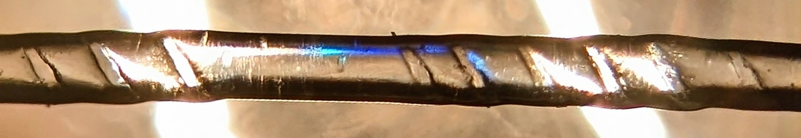
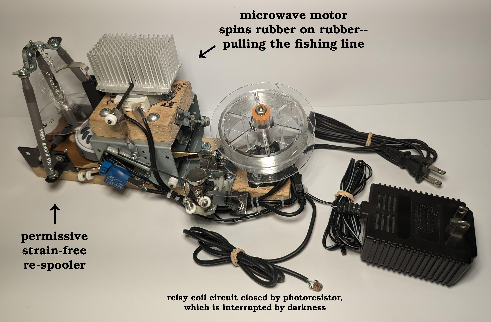
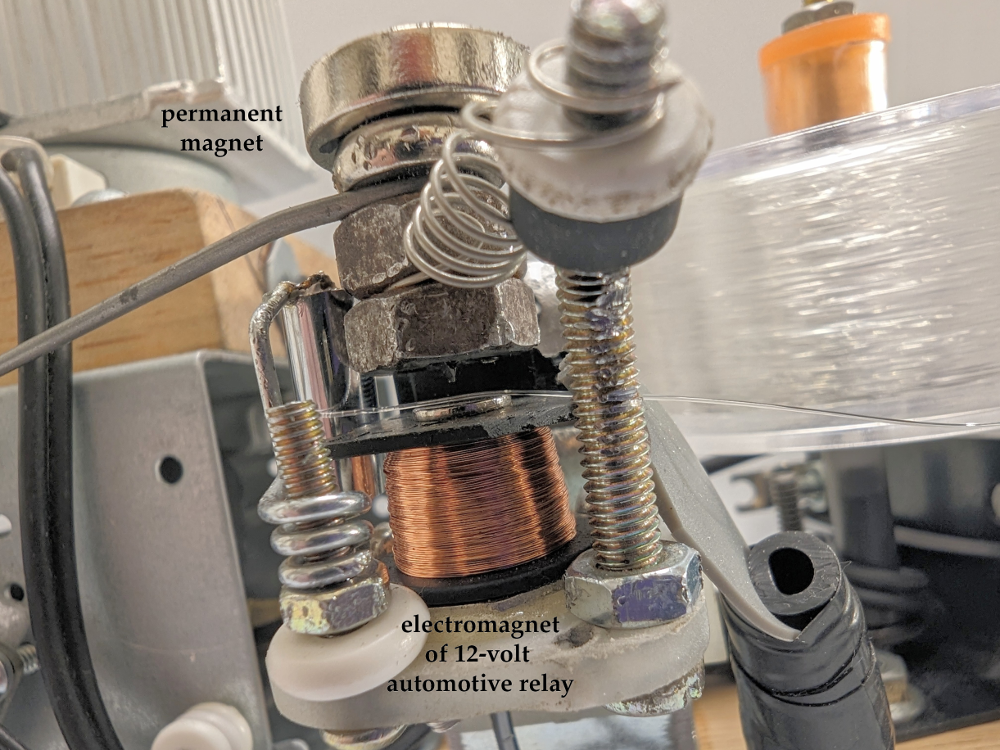
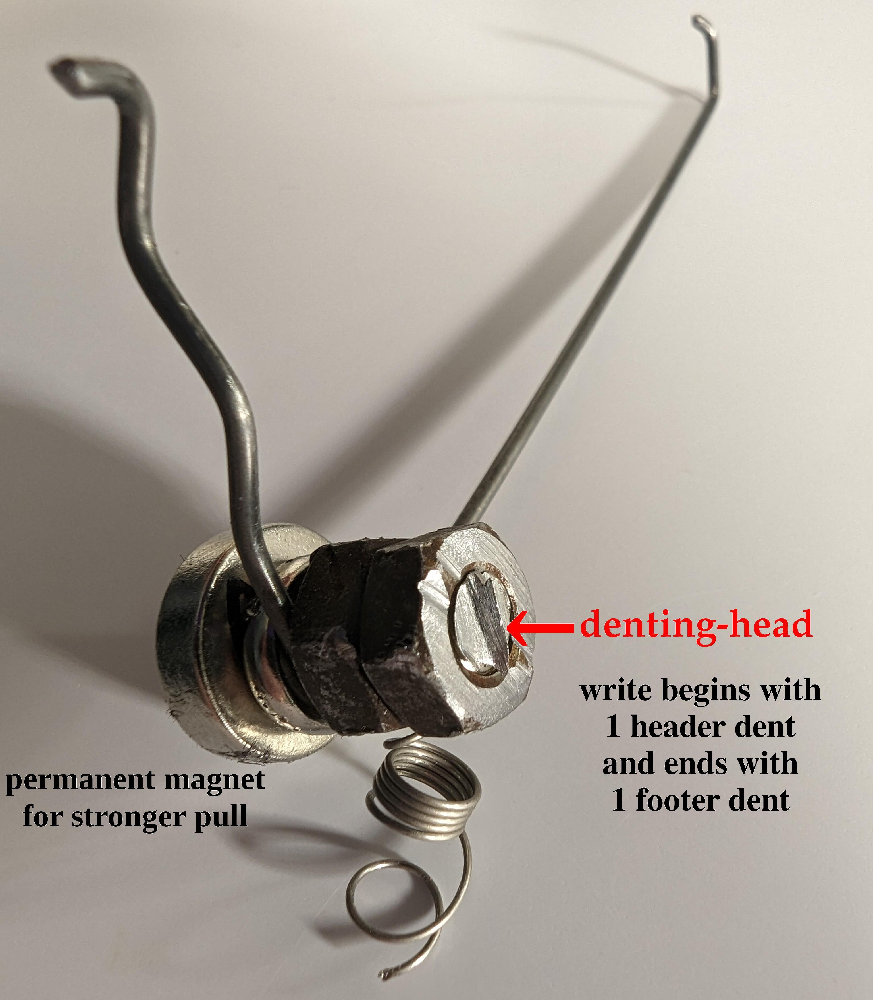
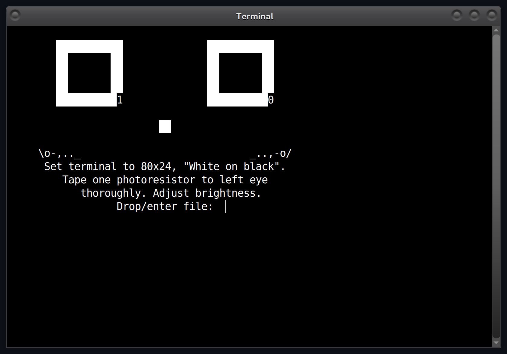
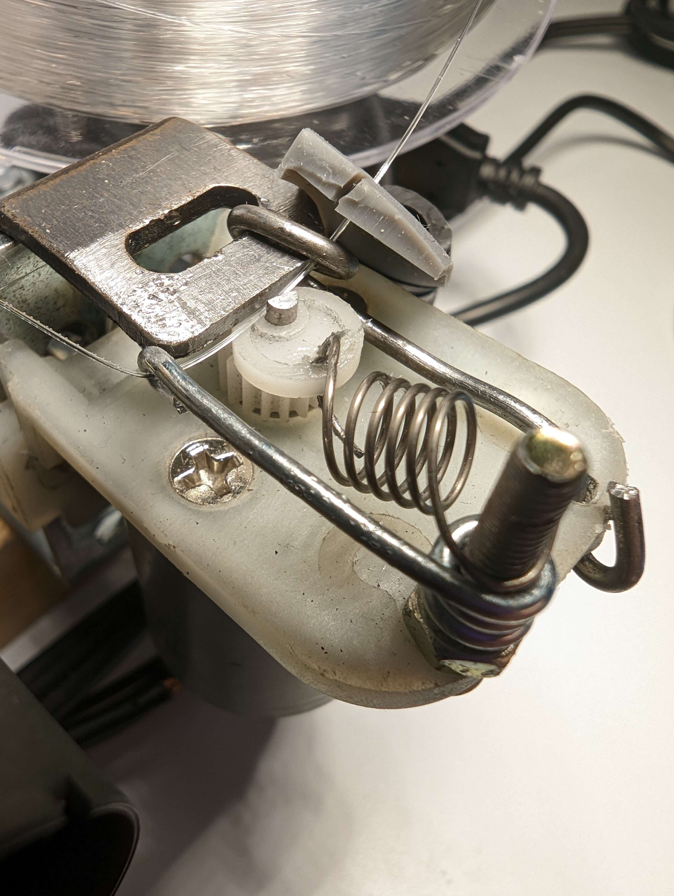

### Run it

```apt install g++ geany```. Open the .cpp in Geany. Hit F9 once. F5 to run.

<br>

<p align="center">
  
</p>

<p align="center">
  
</p>

https://user-images.githubusercontent.com/75550631/216291489-019e72ae-b6fe-4cee-99a8-2ab1f438765e.mp4

<p align="center">
  
</p>

<p align="center">
  
</p>

https://user-images.githubusercontent.com/75550631/216505700-cb351c48-0b0d-4508-a006-fa156a993960.mp4

<p align="center">
  
</p>

<br>

### Old version

https://user-images.githubusercontent.com/75550631/215457914-69d32f73-8303-4fc8-962b-10e2f1c2aa0f.mp4

<p align="center">
  
</p>

Brushed motors are meant to spin, not jerk; every long once in a while it was unresponsive hence version 2.

<br>

### Why

* To preserve something authorities can't kill by waiting; fluorocarbon fishing line
won't degrade for a few thousand years, it's cheap, and easy to "write on."

* To preserve something authorities can't kill remotely; fluorocarbon fishing line
should survive EMPs and the light of WW3 if buried, as well as solar flares
(unlike microelectronics, metals, capacitors, magnets, and electron microbuckets of SSDs.)

* To preserve something authorities can't confiscate; fluorocarbon fishing line
should be a nightmare to search for if buried. Just tie the winding as a ring using
additional fluorocarbon fishing line, rather than using a spool of a different material.

<br>

### DIY

https://github.com/compromise-evident/what-not/blob/main/process_file_by_bits.cpp

<br>

### Appendix

CarbonRecord has been written about on
[HACKADAY](https://hackaday.com/2023/11/08/forever-writing-on-monofilament-fishing-line/)
and [OUTDOORLIFE](https://www.outdoorlife.com/gear/history-preserved-on-fishing-line/). Thank you for the recognition.
